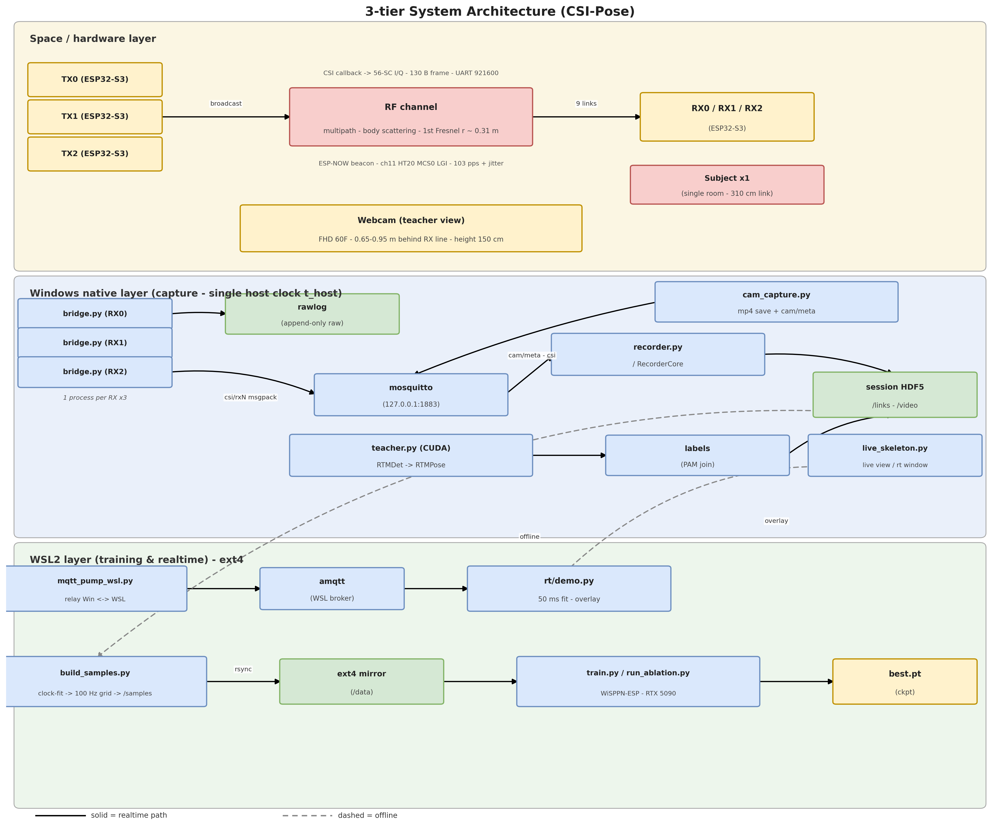
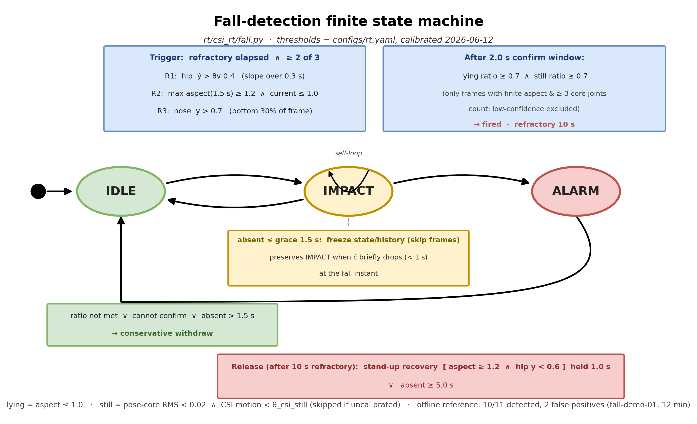
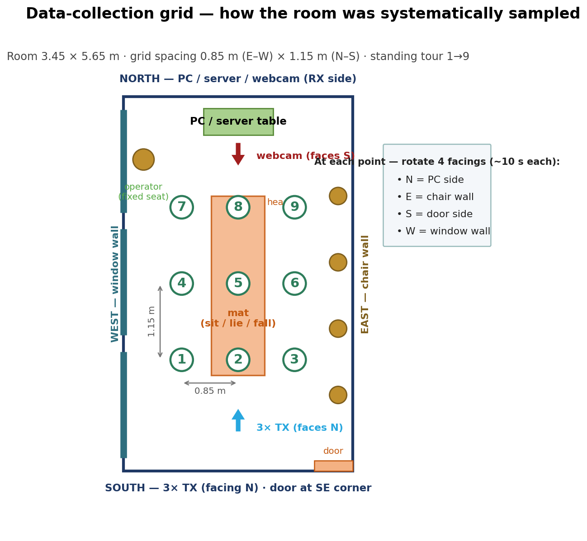
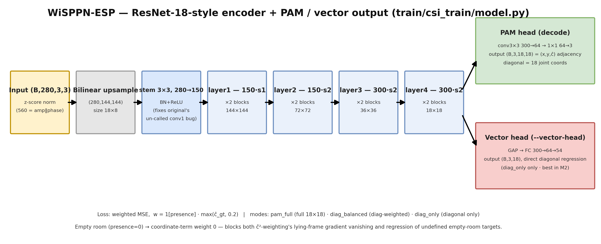

# csi-pose

**English** | [한국어](README.ko.md) | **中文**

基于 WiFi CSI（信道状态信息）实现 2D 单人姿态估计（18 个关节点），并在此基础上通过规则式状态机实现跌倒检测。推断时无需摄像头或穿戴设备——信号来源是人体在 2.4GHz 无线电波（每子载波幅度）上通过散射和阴影效应留下的痕迹。

本项目是 WiSPPN（Intel 5300 单网卡，3×3 **天线矩阵**）移植到六块通用 ESP32-S3 开发板（3TX×3RX）形成的 3×3 **链路矩阵**。使用 webcam + RTMPose 作为教师网络生成伪标签；学生模型从 50ms 时间窗口的 CSI 幅度张量回归关节点坐标——训练完成后，推断时无需摄像头。

<p align="center">
  <br>
  <em>实时演示——绿色 18 关节点骨架完全由 WiFi CSI 推断得出（推断时无摄像头）。顶部横幅显示跌倒检测触发：<strong>PRESENT | ALARM</strong>。</em>
</p>

## 流水线

```
① firmware/  3 块 ESP32-S3 TX 板发送 ESP-NOW 信标（~103 pps）；3 块 RX 板
                提取 CSI → 130B 帧通过串口传输
                （csi_link/ 是 TX/RX 共享组件）
② host/      bridge：串口→原始日志保留 + MQTT 中继 · recorder：HDF5
                会话写入 · csi_pipe：时钟拟合/对齐/采样库 · tools：运维 CLI
③ teacher/   对同步录制的 webcam 视频运行 RTMDet→RTMPose 生成姿态标签
④ train/     训练 CSI→PAM 回归网络（WiSPPN-ESP）
⑤ rt/        实时姿态估计（~20Hz）+ 跌倒检测演示
```

## 系统架构

<p align="center">
  <br>
  <em>三层架构：RF 硬件（ESP32-S3 TX/RX）、原生 Windows 捕获（单一主机时钟）、WSL2 计算（训练与实时）。实线 = 实时路径，虚线 = 离线。</em>
</p>

## 检测内容

模型输出连续的 18 关节点 2D 骨架；在此基础上派生出两个高层信号：

- **姿态——站立与躺卧。** 由估计骨架核心边界框的宽高比分类（大致：框高大于宽 = 站立，宽大于高 = 躺卧）。站立→躺卧的转换也是下方跌倒判据之一。
- **跌倒。** 基于规则式有限状态机（IDLE → IMPACT → ALARM）。当 ≥3 个判据中至少 2 个触发时提升 IMPACT——（R1）骨盆/髋部快速下降、（R2）站立→躺卧转换、（R3）头部掉到画面下半部分——只有在随后的保持窗口内确认持续的"躺卧且静止"姿态后，才升为 ALARM。恢复（站起来或离开区域）则释放警报。

重放演示结果：**11 次脚本化跌倒中检测到 10 次，2 次误报**（单次会话）。

> **诚实边界。** 跌倒阈值是暂定的，由单次会话（`fall-demo-01`）标定；定量的躺卧子集评估和跨会话评估留待更完整的数据采集。本项目暂禁用基于 CSI 的静止检测（各姿态的运动能量分布重叠），因此确认依赖姿态几何。请将其视为一个工作演示，**而非经过验证的医疗或安全设备。**

<p align="center">
  <br>
  <em>跌倒检测状态机（IDLE → IMPACT → ALARM），含规则和释放条件。</em>
</p>

<p align="center">
  <br>
  <em>720 秒会话中 11 次脚本化跌倒的跌倒检测重放：召回率 10/11，准确率 10/12，真阳性中位上升时间 0.34 秒。</em>
</p>

## 核心思路 1——时间同步（对齐异构时钟）

各板的 esp_timer 时钟彼此独立，也独立于主机。每一次捕获（CSI 包到达、webcam 帧抓取）都使用**单一主机时钟 `time.time_ns()`** 打戳——但 USB 串口到达时间包含批处理延迟。关键在于该延迟的**非对称性**：USB 延迟只能让数据包迟到，不能让数据包早到。因此（板时间，主机时间）散点图的**下包络（下凸壳）**是真实时钟变换的无偏估计。

```
 ESP32-S3 板载时钟 (esp_timer µs)      主机时钟 time.time_ns() — 单一参考
        │                                        │
        └────── USB 串口到达 ──────► (esp, t_host) 散点图
                                            │
              USB 批处理延迟只能是 +only   │   ← "提前到达"在物理上不可能
                                            ▼
                       散点的下包络 = 真实时钟变换
            （离线：分段线性拟合每个启动 epoch / 实时：滚动最小值）
                                            │
                                            ▼
        每个 CSI 包 → 校正时间 t_fit → 重采样到 100Hz（10ms）网格
                                            │
 webcam 帧抓取时间（同一主机时钟） ──┤
                                            ▼
              配对校正：truth = stamp − correction（已测量的系统延迟，
              通过 STOP 事件 / 显示器翻转拍摄分解）
                                            ▼
              在每个帧锚点截取 trailing 50ms（5 包）CSI 窗口 → 采样
```

晶振温度漂移被窗口化拟合（600s）和线性插值吸收；板重启通过 boot_id 分割 epoch。残余不确定性约 ±15ms——相当于 2–3m/s 跌倒速度下 3–5cm 的标签噪声。

## 核心思路 2——教师标注（webcam 姿态 → CSI 标签）

Webcam 仅在数据采集期间作为教师使用。从视频中提取的关节点坐标——基于上述公共时间轴对齐——与同一时刻的 CSI 窗口配对，形成 (X, Y) 训练对。

```
 webcam mp4 ──► RTMDet-m（人物检测） ──► RTMPose-m（COCO-17） ──► BODY-18 转换
   │ 每帧 t_ns                                                │（颈部 = 肩部中点）
   │              0 人=no_person · ≥2=multi（丢弃）         ▼
   │                                       QA 门控（随机抽样人工审核，<2%）
   │                                                               │
   ▼                                                               ▼
 t_ns 联接：帧时间 = 锚点 ──► 与同一时刻的 CSI 配对    Y = PAM (3,18,18)
                                              │                    │  对角线 = 关节点 (x,y,ĉ)
 9 条链路（3TX×3RX）× 56 子载波 × 5 包  │                    │
   ──► 幅度张量 X (280,3,3) ──────────┴──► 训练：f(X) ≈ Y
                                                                   │
                                            推断仅用 CSI——无需摄像头
```

空房间帧不丢弃——它们成为 presence=0 的负样本（损失加权自动抑制坐标项）。由于板载晶振独立，链路间相位差是随机量，因此**链路间相位从不作为特征使用**；仅使用幅度（链路内相位形状是可选项消融实验）。各板 AGC 差异被链路级 L2 归一化吸收。

## 数据采集协议

**系统化采样**房间的方法，以及一名操作员 + 一名受试者如何通过键盘标记段进行采集（`m15-cap1` 会话，约 13 分钟）。

<p align="center">
  <br>
  <em>房间在固定的 3×3 网格上采样，使数据集覆盖位置和身体朝向。</em>
</p>

**房间采样。** 房间划分为 **9 个站立位置的 3×3 网格**（0.85m 东西 × 1.15m 南北），以 TX–RX 视线为中心。受试者按顺序访问 **1 → 9**；在每个位置他们**轮转四个朝向——N、E、S、W（每个约 10 秒）**，因此数据集涵盖人的*位置*和*朝向*。中间的垫子用于坐/躺/跌倒段。

**键盘标记段（13 段）。** 操作员按 **Enter** 标记每段的开始和结束；走动和进入/离开发生在标记*之外*，因此时间安排灵活。

| # | 段 | 时长 | 备注 |
|---|---|---|---|
| 1 | 空（引入） | 60 秒 | 确认房间为空，然后提示"进来" |
| 2–10 | 站立，位置 1–9 | 每位置 40 秒 | 踩准交叉点 → **Enter** → 朝 N/E/S/W（每方向约 10 秒）→ **Enter** → 下一位置 |
| 11 | 坐在垫子上（位置 5） | 40 秒 | |
| 12 | 躺在垫子上 | 60 秒 | 头部朝向**北** |
| 13 | 空（引出） | 60 秒 | 受试者离开，关门——需要最后的 **Enter** |

两个**空房间段**（1 和 13）成为 `presence = 0` 的负样本用于训练；记录器在段 13 后自动关闭（`segments = 13, aborted = False`）。

> **采集规则。** 采集过程中绝不 `Ctrl-C` 记录器（会导致该段中止）；采集主机上不运行其他程序（CPU 负载会饿死串口缓冲区）。

## 数学表述

核心公式，用 GitHub math 渲染。

**张量化。** 最近 $P{=}5$ 个包（10ms 网格）× $K{=}56$ 个子载波幅度，每条链路的 9 个链路构建输入张量，通式如下：

$$X[56p+k,\,i,\,j]=A^{(i,j)}_{t-(4-p)\Delta,\;k},\quad p=0\ldots4,\ \Delta=10\text{ ms}\ \Rightarrow\ X\in\mathbb{R}^{280\times3\times3}$$

$$X\in\mathbb{R}^{(P\cdot K)\times N_R\times N_T},\qquad f_\theta:X\mapsto\hat{Y}\in\mathbb{R}^{3\times J\times J},\quad J=18$$

**相位清洗。** 每包 STO/CFO 表现为子载波轴上的线性斜率，通过最小二乘投影去除：

$$\tilde{\varphi}=P\,\mathrm{unwrap}(\varphi),\qquad P=I_{56}-A(A^\top A)^{-1}A^\top,\quad A=[\,\mathbf{k}\ \ \mathbf{1}\,]\in\mathbb{R}^{56\times2}$$

**归一化**——链路级 L2，然后 z-score，可选 RSSI 重缩放：

$$\hat{X}^{(i,j)}=\frac{X^{(i,j)}}{\lVert X^{(i,j)}\rVert_2},\qquad z=\frac{\hat{X}-\mu}{\sigma},\qquad \tilde{X}^{(i,j)}=\hat{X}^{(i,j)}\cdot 10^{\mathrm{RSSI}_{ij}/20}$$

**学习目标**——姿态邻接矩阵的加权 MSE，存在加权门控和置信度下界：

$$\mathcal{L}=\frac{1}{|\Omega|}\sum_{(u,v)\in\Omega}w_{uv}\lVert\hat{Y}_{uv}-Y_{uv}\rVert_2^2,\qquad w=\mathbb{1}[\text{presence}]\cdot\max(\hat{c}_{\mathrm{gt}},\,0.2)$$

**评估**——$\mathrm{PCK@}\alpha$，使用躺卧稳健的分母 $D_f$：

$$\mathrm{PCK@}\alpha=\mathbb{E}_{(f,j):\,c_{fj}\ge0.3}\big[\mathbb{1}(\lVert\hat{p}_{fj}-p_{fj}\rVert_2\le\alpha D_f)\big]$$

$$D_f=\mathbb{1}[\mathrm{AR}_f{<}0.8]\max(\mathrm{torso}_f,\kappa\,\mathrm{diag}_f)+\mathbb{1}[\mathrm{AR}_f{\ge}0.8]\,\mathrm{torso}_f,\qquad \kappa=\mathrm{median}_{f:\,\mathrm{AR}_f\ge1.2}\frac{\mathrm{torso}_f}{\mathrm{diag}_f}$$

**时钟模型与配对。** USB 批处理延迟非负，因此（板，主机）时间戳散点的下包络是无偏时钟变换；视频通过测量系统偏移对齐：

$$t^{\text{host}}=(1+\rho)\,t^{\text{esp}}+\beta+\delta_{\text{usb}}+\varepsilon,\quad \delta_{\text{usb}}\ge0\ \Rightarrow\ \text{lower-envelope fit}$$

$$\mathrm{anchor}'=t_{\text{vid}}-(\Delta_{\text{cam}}-\Delta_{\text{csi}})=t_{\text{vid}}-156.12\text{ ms}$$

**实时算子**——无模型运动能量，和跌倒规则 R1（髋部在 0.3s 窗口内的下降斜率）：

$$E(t)=\frac{1}{9}\sum_{i,j}\mathrm{std}_{s\in[t-w,\,t]}\bar{A}^{(i,j)}(s),\quad \bar{A}=\frac{1}{K}\sum_k A_k,\ \ w=0.5\text{ s}$$

$$\hat{\beta}_1=\arg\min_{\beta}\sum_{s\in[t-0.3,\,t]}\big(y^{\text{hip}}_s-\beta_0-\beta_1 s\big)^2,\qquad \text{R1 fires when }\hat{\beta}_1>\theta_v=0.4$$

## 模型

<p align="center">
  <br>
  <em>WiSPPN-ESP——在 (280,3,3) CSI 幅度张量上的 ResNet-18 风格编码器，末端接 PAM 解码头（18×18 邻接矩阵）或直接回归 18 个关节点坐标的向量头。</em>
</p>

## 结果

> 单次会话、单一受试者、单一房间（时间序 80/20 划分）。这些是工作演示数字，非跨环境基准——跨会话和躺卧子集评估留待更完整的数据采集。

<p align="center">
  <br>
  <em>CSI 运动统计量与摄像机测量的人体运动：Pearson <strong>r = 0.603</strong>（n = 4,391）；滞后互相关峰值在 −0.1s，确认 CSI–视频对齐在 100ms 以内。</em>
</p>

<p align="center">
  <br>
  <em>CSI 幅度时频图（单链路，56 子载波），CSI 运动统计量追踪视觉导出的关节点速度。</em>
</p>

<p align="center">
  <br>
  <em>输入表示消融：最佳运行 PCK@0.2 = 0.495 / PCK@0.5 = 0.897——超过绝对门控（0.35）和两个基线（均值姿态 0.185，kNN 0.321）。</em>
</p>

<p align="center">
  <br>
  <em>各关节点 PCK@0.2 vs 基线——学习模型在运动丰富的手部和手臂关节点上获胜，证明它学习的是运动相关信道特征而非回放静态姿态。</em>
</p>

<p align="center">
  <br>
  <em>各链路 RSSI 分布，空 vs 占用——占用加宽了每条链路的分布，为 RSSI 作为辅助输入特征提供了依据。</em>
</p>

更多图表（子载波/链路相关性、相位清洗、训练曲线）：见 [`docs/figures/`](docs/figures/)。

## 硬件要求

- 6 块 ESP32-S3 开发板（3 TX + 3 RX，使用 ESP-IDF 构建——HT20，56 子载波）
- 6 个 USB-UART 适配器/电缆（CH340 等）或板载 USB Serial/JTAG
- 1 个 USB webcam（仅用于教师标签采集——推断时不需要）
- MQTT broker（mosquitto，默认 localhost:1883）

推荐配置：捕获（串口/webcam）在原生 Windows，训练和实时推理在 WSL2（ext4）——便于时间戳统一和 I/O 性能。单一操作系统配置也可正常工作。

<p align="center">
  <br>
  <em>测量房间（3.45 × 5.65 m）。TX 阵列（底部，面朝上）和 RX + 摄像头集群（顶部，面朝下）沿长轴彼此相对；中间的床垫是跌倒落点。</em>
</p>

## 快速开始

```bash
pip install -r requirements.txt

# 本地配置——复制示例并填写环境信息
#（原件被 gitignore）
cp configs/boards.example.yaml configs/boards.yaml   # COM 端口 · 板载 MAC
cp configs/train.example.yaml  configs/train.yaml    # 会话 h5 路径

# 固件（ESP-IDF v5.x）
cd firmware/tx && idf.py set-target esp32s3 build flash    # 3 块 TX 板
cd firmware/rx && idf.py set-target esp32s3 build flash    # 3 块 RX 板
```

命名约定：`csi_*` 目录（`csi_host/`、`csi_pipe/`、`csi_train/` …）是库模块；同级顶层脚本（`bridge.py`、`train.py` …）是 CLI 封装。

注：代码注释和 CLI 帮助字符串使用韩语编写。"设计 §N" / "스펙 …" 注释引用内部设计文档的章节编号。

## 作者

Kyung-Bo Kim, Hyun-Seok Jang, So-Hyeon Kim, and Gyu-Chae Jung.

## 归属与许可声明

- **`train/csi_train/model.py`** 是基于 [geekfeiw/WiSPPN](https://github.com/geekfeiw/WiSPPN) 中 `models/wisppn_resnet.py` 的非官方修改实现。
  论文：Fei Wang, Stanislav Panev, Ziyi Dai, Jinsong Han, Dong Huang,
  *"Can WiFi Estimate Person Pose?"*, [arXiv:1904.00277](https://arxiv.org/abs/1904.00277) (2019)。
  上游仓库没有许可证文件；衍生部分的版权仍归原作者所有。本仓库在注明来源的情况下使用。
- **教师阶段**在首次运行时自动从 download.openmmlab.com 下载 RTMDet/RTMPose ONNX 模型（[OpenMMLab mmpose](https://github.com/open-mmlab/mmpose)，Apache-2.0）。模型文件本身不包含在本仓库中。
- `teacher/csi_teacher/qa.py` 中的 BODY-18 肢体定义是标准 OpenPose 骨架拓扑（事实数据）。

本仓库许可证：[MIT](LICENSE)。注意，`train/csi_train/model.py` 中源自原始作者的部分仍受原始作者版权约束，独立于本仓库的许可证。
